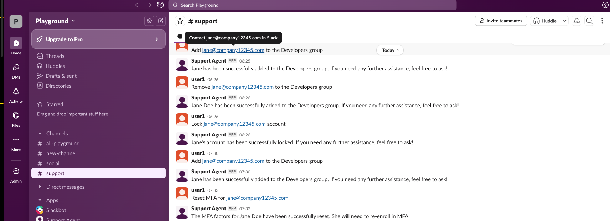
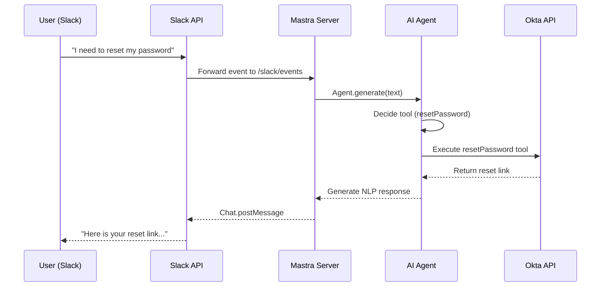
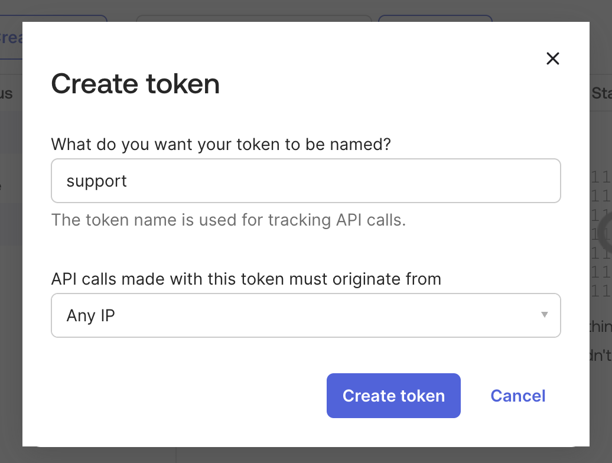
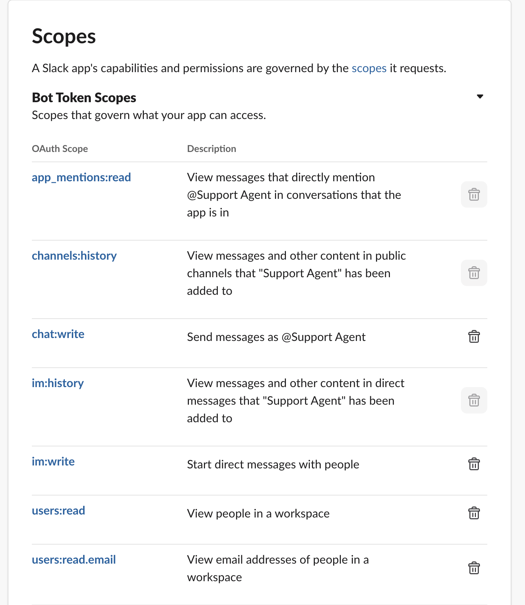
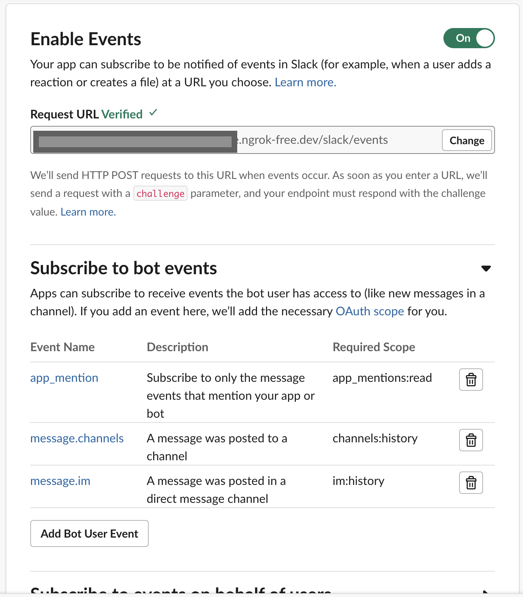
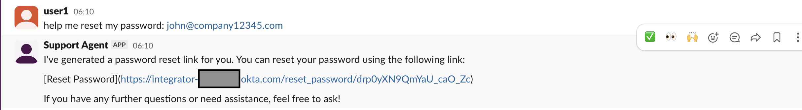
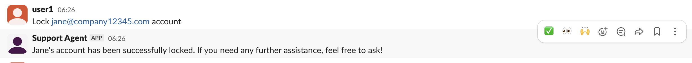
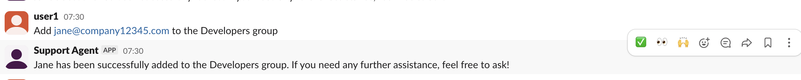
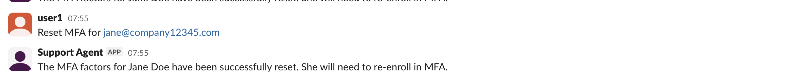

# Building an AI IT/HR Support Agent with Mastra.ai, Slack, and Okta

In the modern workplace, IT and HR support teams are often overwhelmed with repetitive requests: "I forgot my password," "Can I join the Engineering group?", "How do I reset my MFA?". These are simple questions that take up valuable time. We thought about how we could have a tireless, intelligent agent living right in Slack (or whatever platform our team already uses), to handle these requests. We built an AI agent using Mastra.ai to do this by connecting it to an identity provider (Okta, in this case). 

## Target Workflows


Our agent will handle some common questions that could be asked to an IT/HR support team :
*   **Password Resets**: Safely resetting user passwords via Okta. This sends a reset link directly in Slack.
*   **Access Provisioning**: Adding users to specific groups (e.g., "Add John to the Engineering group").
*   **User Lookup**: Find an Okta user by their email address.
*   **Lock User**: Lock a user's account.
*   **Unlock User**: Unlock a user's account.
*   **MFA reset**: Reset a user's MFA, forcing them to re-enroll. 

We'll deploy this agent to **Slack**, making it accessible to the entire company with zero new software to install.

## How Mastra, Slack and Okta work together

mastra.ai is a framework for building AI agents. It handles the "thinking" (using OpenAI's gpt-4o-mini model), sends commands to tools, and provides a built-in server. Okta is our identity provider, which stores information about users and groups, and is responsible for authentication and authorization into various services. The agent will use Okta's API to manage users and groups. Slack is the user interface where users can ask questions to the agent. 

## Architecture Overview

Here is how the system flows:



1.  **User** sends a message in Slack: *"I need to reset my password"*
2.  **Slack API** sends this event to our **Mastra Server**.
3.  **Mastra Agent** analyzes the request.
4.  **Agent** executes the **Okta Tool**.
5.  **Okta API** processes the request and returns a reset link.
6.  **Agent** generated a response: *"I've generated a reset link for you: [link]"*
7.  **Mastra Server** posts this back to Slack.

---

## Setup

### 1. Create a Mastra Project

Mastra makes it easy to start a new project using the `npm create mastra` command:

```bash
npm create mastra@latest mastra-support-agent
```
The above command prompts us to select a folder to create the project in, a model provider, our API key and our IDE. We chose OpenAI as the model provider.  For the other options, we used the default values.

```bash
cd mastra-support-agent
npm install dotenv
```
The scaffolded project would have files for an example weather agent. We removed them and created our own files.

## Building the Agent

The full code for this agent is available in [mastra-support-agent](./) repo. We show some snippets here for clarity. 

## Tools

First, we created tools to interact with Okta. Mastra uses Zod for schema validation, ensuring the LLM calls these functions correctly. 

We created [src/mastra/tools/okta.ts](src/mastra/tools/okta.ts):

```typescript
import { createTool } from "@mastra/core/tools";
import { z } from "zod";

const getHeaders = () => ({
  Authorization: `SSWS ${process.env.OKTA_API_TOKEN}`,
  Accept: "application/json",
});

export const findUserByEmail = createTool({
  id: "find-user-by-email",
  description: "Find an Okta user by their email address",
  inputSchema: z.object({
    email: z.string().email(),
  }),
  // ... outputSchema and execute logic detailed in repo
  execute: async ({ context }) => {
     // Fetch logic...
  }
});

export const resetPassword = createTool({
  id: "reset-password",
  description: "Generate a password reset link for an Okta user",
  inputSchema: z.object({
    userId: z.string(),
  }),
  outputSchema: z.object({
    resetPasswordUrl: z.string(),
  }),
  execute: async ({ context }) => {
    // Okta API call to /lifecycle/reset_password
  },
});

// ... Add other tools like getUserGroups, lockUser, etc.
```

### Workflows

Next, we used Mastra's Agent system to define the agent, giving it instructions on how to handle requests and which tools available. Here, it is important to provide detailed instructions (prompts) that guide the agent on how to handle requests correctly.

We created [src/mastra/agents/agent.ts](src/mastra/agents/agent.ts):

```typescript
import { Agent } from "@mastra/core/agent";
import { openai } from "@ai-sdk/openai";
import { findUserByEmail, resetPassword, getUserGroups } from "../tools/okta";

export const itAgent = new Agent({
  name: "it-support-agent",
  description: "An IT support agent that can help with Okta user management, password resets, account locking, and group management",
  instructions: `
      You are an internal IT support agent.
      Use Okta as the source of truth.
      Only perform account actions for the requesting user or when explicitly authorized.
      Never invent data.

      When a user asks about groups, first find them by email, then get their groups.
      When a user needs a password reset, first find them by email, then generate the reset link.
      When locking/unlocking accounts, first find the user by email.
      When adding a user to a group, first find the user by email, then find the group by name, then add them.
      When resetting MFA, first find the user by email, then reset their factors.

      Be cautious with sensitive operations like account locking and MFA resets - confirm the user's identity when possible.
  `,
  model: openai("gpt-4o-mini"),
  tools: { findUserByEmail, resetPassword, getUserGroups },
});
```
We used OpenAI's GPT-4o-mini model, which despite being a smaller model, provides good performance and is cost-effective for this type of task.

### Responding to Slack

We edited [src/mastra/index.ts](src/mastra/index.ts) to add a Slack event handler:

```typescript
import { Mastra } from "@mastra/core/mastra";
import { registerApiRoute } from "@mastra/core/server";
import { itAgent } from "./agents/agent";

export const mastra = new Mastra({
  agents: { itAgent },
  server: {
    port: 3000,
    apiRoutes: [
      registerApiRoute("/slack/events", {
        method: "POST",
        handler: async (c) => {
          const body = await c.req.json();
          const { type, challenge, event } = body;
          // we need to do this for slack to verify our app
          if (type === "url_verification") return c.json({ challenge });

          c.status(200);
          if (event?.bot_id) return c.body(null);
          if (event?.text && !event.bot_id) {
             const agent = c.get("mastra").getAgent("itAgent");
             const result = await agent.generate(event.text);
             
             // Post back to Slack
             await fetch("https://slack.com/api/chat.postMessage", {
                method: "POST",
                headers: { 
                    Authorization: `Bearer ${process.env.SLACK_BOT_TOKEN}`,
                    "Content-Type": "application/json"
                },
                body: JSON.stringify({
                    channel: event.channel,
                    text: result.text
                })
             });
          }
          return c.body(null);
        },
      }),
    ],
  },
});
```

Finally, we could run the agent with `npm run dev`, which starts a local server on port 3000. We need to expose this port to the internet to receive events from Slack, and we use [ngrok](https://ngrok.com) for this: `ngrok http 3000`. This gives us a URL like `https://abcd1234.ngrok-free.dev` which we use to configure our Slack app as described below. 

---

### 2. Setting Up Okta

We need an Okta developer account that provides the API for our agent to interact with Okta.
1.  Sign up at [developer.okta.com](https://developer.okta.com) for an Okta Platform account.
2.  After signing up, we are given an org URL (e.g., `https://integrator-xxxxxxx.okta.com`).
3.  We can create an API Token in *Security > API > Tokens*. Allow API calls from *Any IP*.
    
4.  We created some test users and groups in the Okta Dashboard. The email addresses we specify here would be used by the agent to find users in Okta and perform actions on them.

### 3. Set Up Slack

1.  Create a new app at [api.slack.com/apps](https://api.slack.com/apps) or use an existing app.
2.  Under **OAuth & Permissions**, add these **Bot Token Scopes**: `chat:write`, `im:history`, `users:read`, `users:read.email`, `app_mentions:read`.
    
3.  We installed the app to our workspace and grab the **Bot User OAuth Token** (`xoxb-...`).
4. For local development, we need a way to expose our local port to the internet, so that Slack can send events to our server. We use [ngrok](https://ngrok.com) to expose this port with: `ngrok http <port>`. This gives us a URL like `https://abcd1234.ngrok-free.dev`.
    
5.  We enabled **Event Subscriptions** in Slack settings using our ngrok URL + `/slack/events` (e.g., `https://abcd1234.ngrok-free.dev/slack/events`). Subscribe to `message.im`, `message.channel`, and `app_mention`. This will allow the agent to respond to direct messages, channel messages, and mentions respectively.
    

### Configure Environment

Create a `.env` file:
```env
OPENAI_API_KEY=sk-...
SLACK_BOT_TOKEN=xoxb-...
OKTA_ORG_URL=https://integrator-xxxxxxx.okta.com
OKTA_API_TOKEN=...
PORT=3000
```

---

## Workflow Examples

### Password Reset

**User**: "help me reset my password: john@company12345.comm"

**Agent**:
1. Calls `findUserByEmail` with the sender's email.
2. Calls `resetPassword` with the User ID.
3. **Reply**: "I've generated a password reset link for you. You can reset your password using the following lin [Reset Password](https://integrator-xxxxxxx.okta.com/reset_password/drp0yXN9QmYaU_caO_Zc)"



### Account Locking
**User**: "Lock jane@company12345.com account"

**Agent**:
1. Calls `findUserByEmail` with the sender's email.
2. Calls `lockUser` with the User ID.
3. **Reply**: "Jane's account has been successfully locked. If you need any further assistance, feel free to ask!"



### Group Management
**User**: "Add jane@company12345.com to the Developers group"

**Agent**:
1. Calls `findUserByEmail` with the sender's email.
2. Calls `addUserToGroup` with the User ID and Group Name.
3. **Reply**: "Jane Doe has been successfully added to the Developers group."



### MFA Reset
**User**: "Reset MFA for jane@company12345.com"

**Agent**:
1. Calls `findUserByEmail` with the sender's email.
2. Calls `resetMFA` with the User ID.
3. **Reply**: "The MFA factors for Jane Doe have been successfully reset. She will need to re-enroll in MFA."



---

## Looking forward

This is a simple example of how we used Mastra to build an AI agent that can interact with Okta and Slack. 
It is a good starting point for building more complex agents that can handle a wide range of tasks. 

